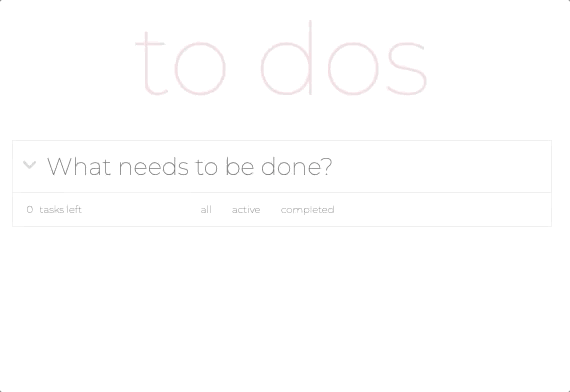
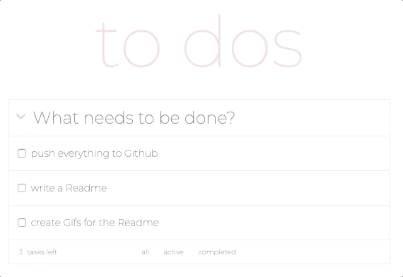
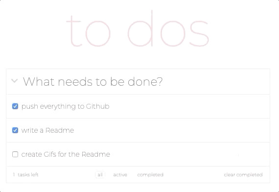

# To-Do-List

## Overview

A Simple To-Do list I created to deepen my knowlege in jQuery and Javascript

## Technologie

- JavaScript, jQuery, html5, CSS3, flexbox

## Features

- creating tasks
- check completet tasks
- show how many tasks are left
- filter all, active, completet 
- clear completed

## Preview

**create tasks**

**check and filter tasks**

**delete completet tasks**

